<div align="center">


<h1>AWS Bedrock Blueprints</h1>

<p><strong>Production-Ready Generative AI Architectures, Secure Foundational AI Operating Models & RAG Accelerators</strong></p>

[](https://devopstrio.co.uk/)
[](https://devopstrio.co.uk/)
[](https://devopstrio.co.uk/)
[](/apps/agent-engine)

</div>

---

## 🏛️ Executive Summary

**AWS Bedrock Blueprints** is a flagship enterprise platform designed to accelerate the adoption of Generative AI within regulated organizations. By providing a curated collection of production-ready reference architectures, the platform establishes a secure, governed, and scalable foundation for deploying **Amazon Bedrock** solutions. From high-performance **RAG (Retrieval-Augmented Generation)** pipelines to complex **Agentic Workflows**, this platform codifies the engineering standards required for enterprise AI.

The platform integrates advanced **Governance, Cost, and Security Engines** to ensure that AI innovation does not come at the cost of compliance or budget. Organizations can now launch secure model experimentations, deploy internal knowledge assistants, and orchestrate multi-model workflows with the confidence of built-in **PII redaction**, **guardrail enforcements**, and **automated token-cost allocation**.

### Strategic Business Outcomes
- **Accelerated Time-to-Value**: Deploy secure GenAI solutions in hours instead of months through standardized, IaC-backed blueprint patterns.
- **Enterprise-Grade Governance**: Enforce responsible AI principles with automated prompt approvals, model access controls, and continuous drift detection.
- **Optimized AI Economics**: Gain granular visibility into token consumption and model performance through the integrated Cost Engine and chargeback reporting.
- **Uncompromised Data Sovereignty**: Protect sensitive data through Private VPC Endpoints, KMS integration, and automated guardrail filtering before data reaches the model.

---

## 🏗️ Technical Architecture Details

### 1. High-Level AI Operating Model
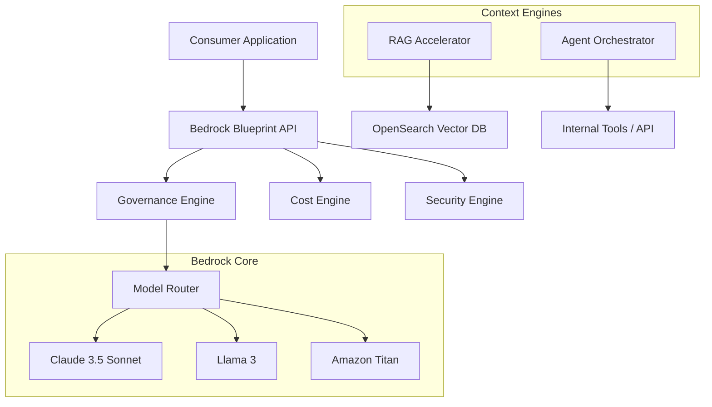

### 2. RAG Ingestion Workflow
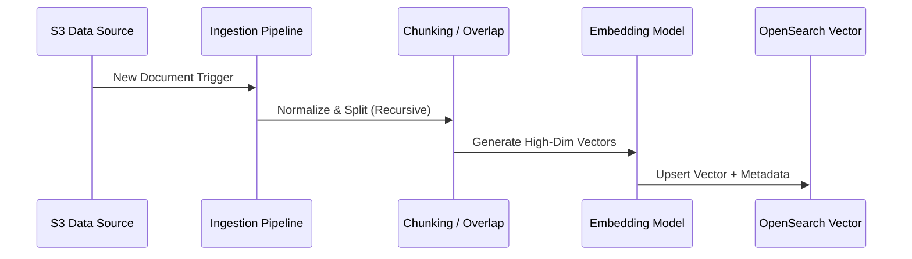

### 3. Agent Execution Lifecycle
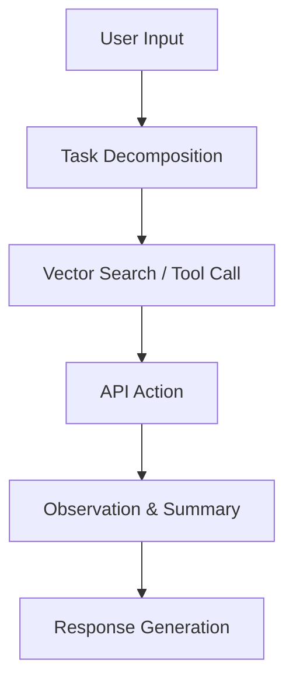

### 4. Prompt Approval Flow
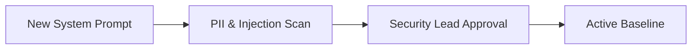

### 5. Cost Governance Workflow
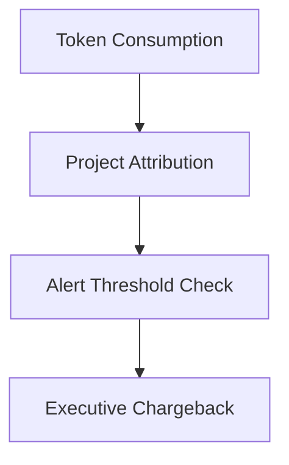

### 6. Security Trust Boundary
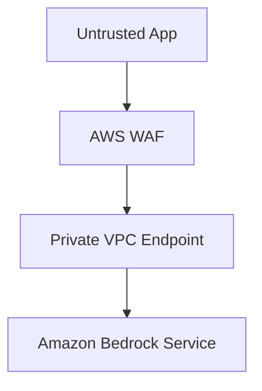

### 7. AWS Multi-Region AI Topology
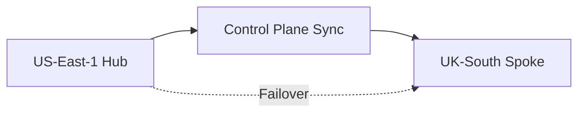

### 8. API Request Lifecycle
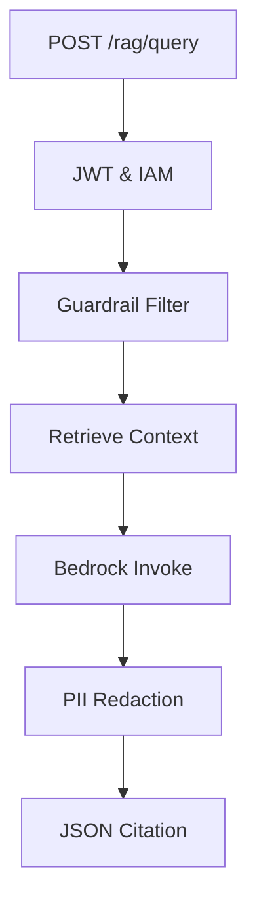

### 9. Multi-Tenant Tenancy Model
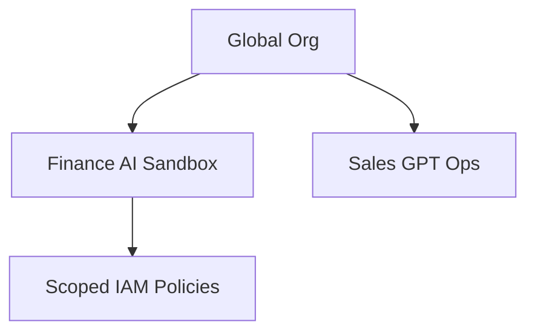

### 10. Monitoring & Telemetry Flow
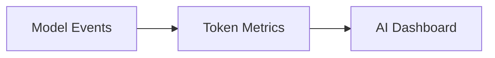

### 11. Disaster Recovery Topology
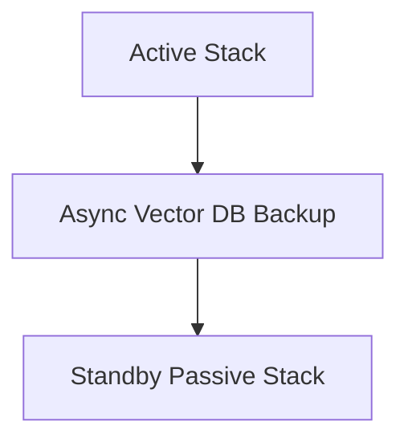

### 12. Private Endpoint Flow
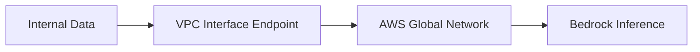

### 13. Identity Federation Model
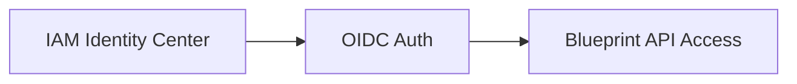

### 14. Model Routing Workflow
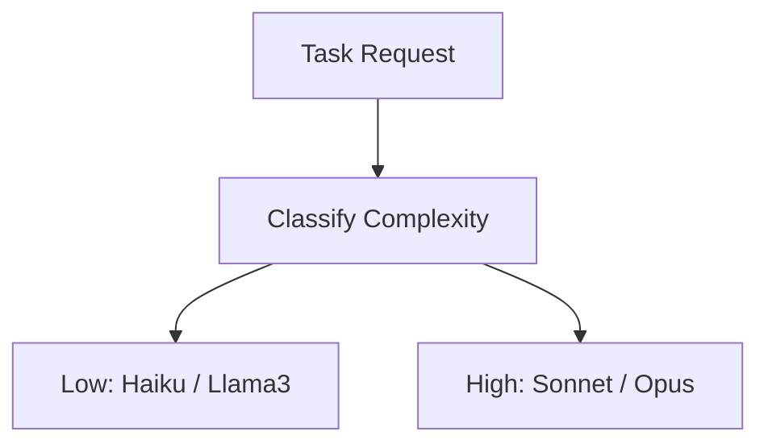

### 15. CI/CD Pipeline
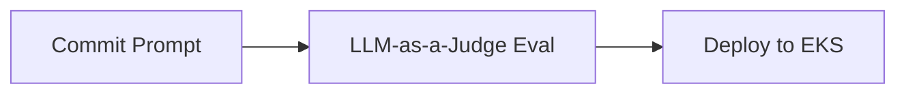

### 16. Executive Governance Workflow
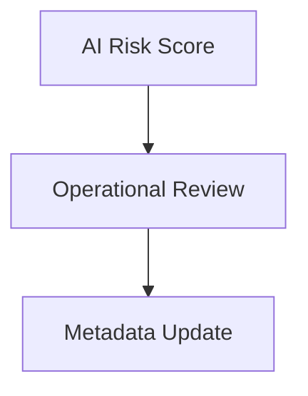

### 17. Data Source Sync Flow
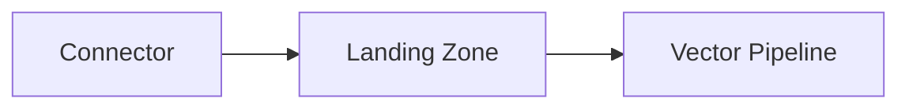

### 18. Global Region AI Topology
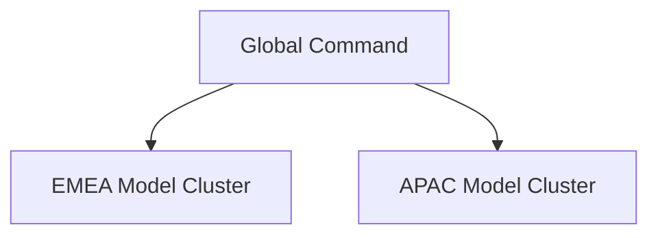

### 19. Chargeback Workflow
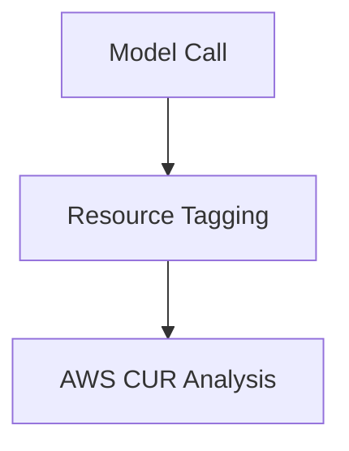

### 20. Responsible AI Control Loop
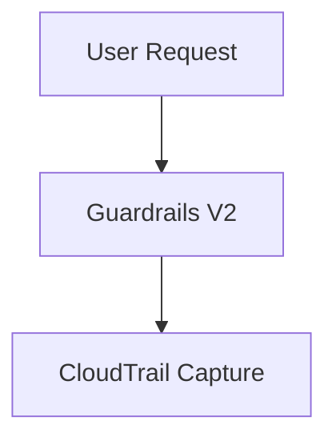

---

## 🚀 Deployment Guide

### Terraform Orchestration
```bash
cd terraform/environments/prd
terraform init
terraform apply -auto-approve
```

---
<sub>&copy; 2026 Devopstrio &mdash; Engineering the Scalable Foundation for the Enterprise AI Revolution.</sub>
