<div align="center">


<h1>AWS Bedrock Blueprints</h1>

<p><strong>The Institutional-Grade Platform for Standardized AI Foundations, Bedrock Governance, and Multi-Cloud Intelligence Ecosystems.</strong></p>

[]()
[]()
[]()

<br/>

> **"Industrializing AI intelligence to automate bedrock foundations."** 
> **AWS Bedrock Blueprints** is an enterprise-grade platform designed to provide a secure, measurable, and highly automated foundation for global Generative AI operations. It orchestrates the complex lifecycle of AI environments—from automated model provisioning and multi-cloud RAG reconciliation to high-throughput inference intelligence and unified security auditing.

</div>

---

## 🏛️ Executive Summary

Fragmented AI perimeters and manual RAG orchestration are strategic operational liabilities; lack of a standardized AI framework is a primary barrier to organizational engineering maturity. Organizations fail to scale their AI workloads not because of a lack of models, but because of fragmented evaluation standards, lack of automated networking reconciliation, and an inability to orchestrate intelligence planes with operational precision.

This platform provides the **Intelligence Plane**. It implements a complete **AWS-Bedrock-Blueprints-as-Code Framework**, enabling CTOs and AI Architects to manage global AI foundations as first-class citizens. By automating the identification of architectural regressions through real-time telemetry analysis and orchestrating the provisioning of secure performance-driven AI policies, we ensure that every organizational AI resource—from core foundation models to edge vector stores—is provisioned by default, audited for history, and strictly aligned with institutional AI frameworks.

---

## 📐 Architecture Storytelling: Principal Reference Models

### 1. Principal Architecture: Global AI Intelligence & Intelligence Plane
This diagram illustrates the high-level relationship between the Consumer Application, the Orchestration Layer (Governance, Routing, RAG, Agent), and the underlying AWS Bedrock foundation models. It defines the bridge between enterprise users and AI intelligence.

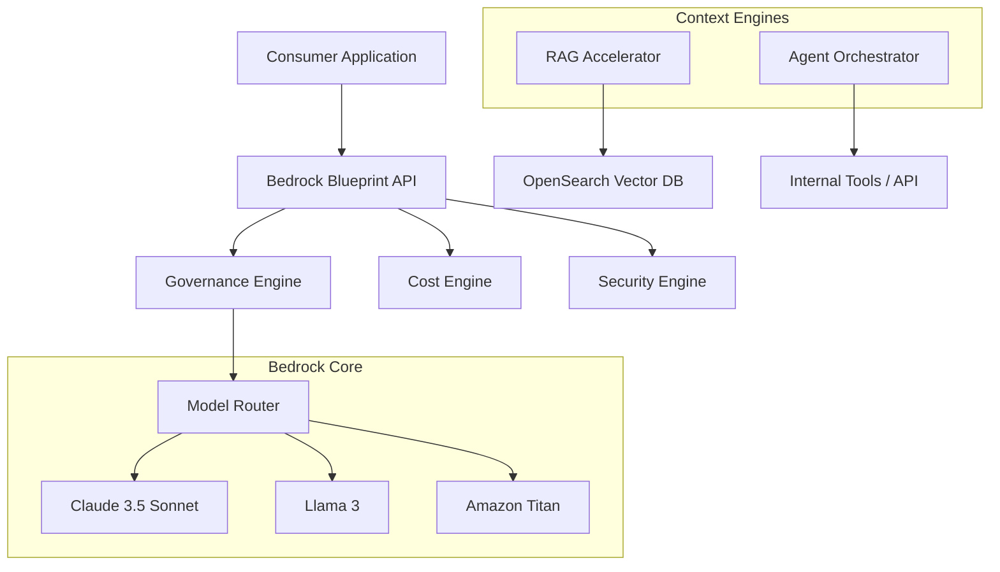
```mermaid
graph TD
    App[Consumer Application] --> Gateway[Bedrock Blueprint API]
    Gateway --> Gov[Governance Engine]
    Gov --> Router[Model Router]
    
    subgraph "Bedrock Core"
        Router --> Claude[Claude 3.5 Sonnet]
        Router --> Llama[Llama 3]
        Router --> Titan[Amazon Titan]
    end
    
    subgraph "Context Engines"
        RAG[RAG Accelerator]
        Agent[Agent Orchestrator]
    end
    
    RAG --> OS[OpenSearch Vector DB]
    Agent --> Tools[Internal Tools / API]
    
    Gateway --> Cost[Cost Engine]
    Gateway --> Sec[Security Engine]
```

### 2. The Intelligence Lifecycle Flow (RAG & Ingestion)
The continuous path of an AI platform from S3 data ingestion and recursive chunking to embedding generation and vector store upserting. This ensures zero-interruption operations through dependency-aware data engineering.

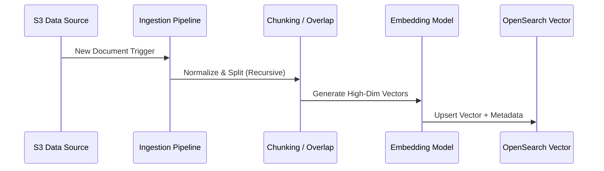
```mermaid
sequenceDiagram
    participant S3 as S3 Data Source
    participant Ingest as Ingestion Pipeline
    participant Chunk as Chunking / Overlap
    participant Vec as Embedding Model
    participant DB as OpenSearch Vector

    S3->>Ingest: New Document Trigger
    Ingest->>Chunk: Normalize & Split (Recursive)
    Chunk->>Vec: Generate High-Dim Vectors
    Vec->>DB: Upsert Vector + Metadata
```

### 3. Distributed Intelligence Topology (Agent & Routing Patterns)
Strategically orchestrating standardized AI agents and routing logic across global regions and diverse resource architectures, providing a unified institutional view of agentic maturity.

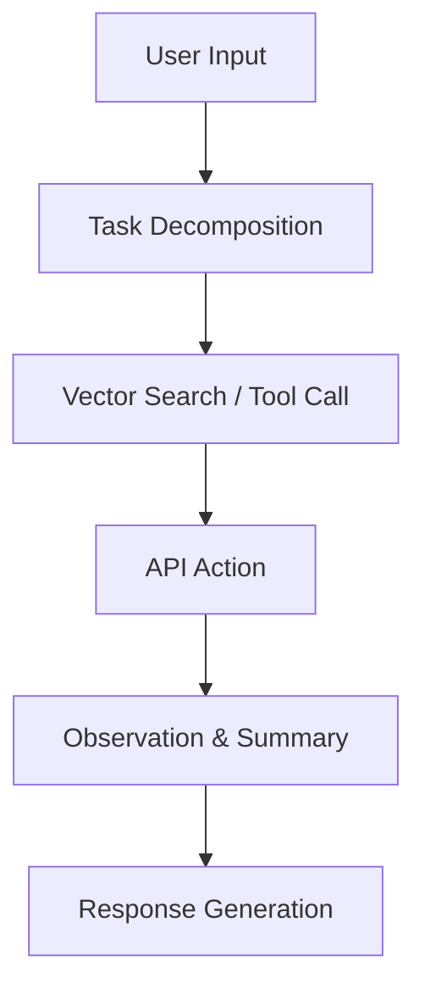
```mermaid
graph TD
    Prompt[User Input] --> Plan[Task Decomposition]
    Plan --> Search[Vector Search / Tool Call]
    Search --> Execute[API Action]
    Execute --> Reflect[Observation & Summary]
    Reflect --> Final[Response Generation]
```

**Model Routing Workflow:**
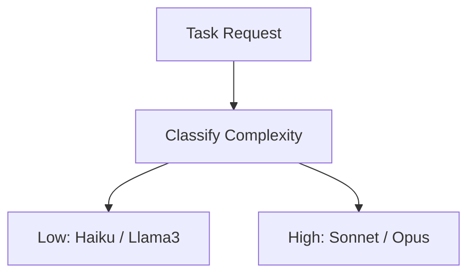
```mermaid
graph TD
    Req[Task Request] --> Class[Classify Complexity]
    Class --> Cheap[Low: Haiku / Llama3]
    Class --> Exp[High: Sonnet / Opus]
```

**Data Source Sync Flow:**
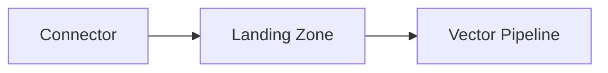
```mermaid
graph LR
    SharePoint[Connector] --> S3[Landing Zone]
    S3 --> RAG[Vector Pipeline]
```

### 4. Governance Hub & Control Plane Flow
Executing complex logic for securing the bridge between AI prompt drafts and production models, ensuring every request is authorized, costs are tracked, and executive oversight is maintained.

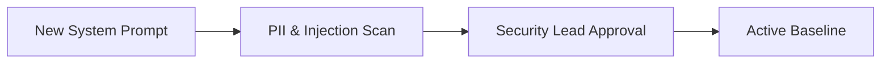
```mermaid
graph LR
    Draft[New System Prompt] --> Scan[PII & Injection Scan]
    Scan --> Human[Security Lead Approval]
    Human --> Live[Active Baseline]
```

**API Request Lifecycle:**
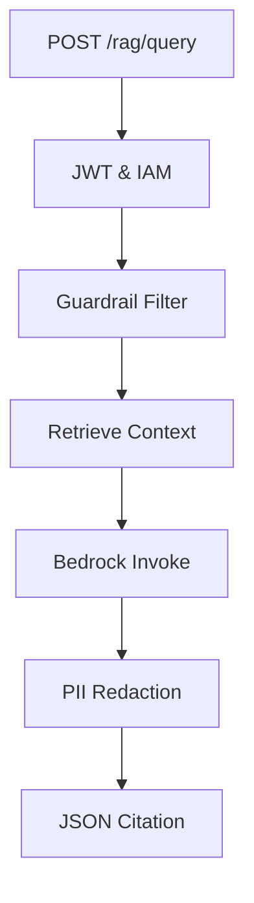
```mermaid
graph TD
    Req[POST /rag/query] --> Auth[JWT & IAM]
    Auth --> Gov[Guardrail Filter]
    Gov --> RAG[Retrieve Context]
    RAG --> LLM[Bedrock Invoke]
    LLM --> Post[PII Redaction]
    Post --> Resp[JSON Citation]
```

**Cost & Chargeback Workflow:**
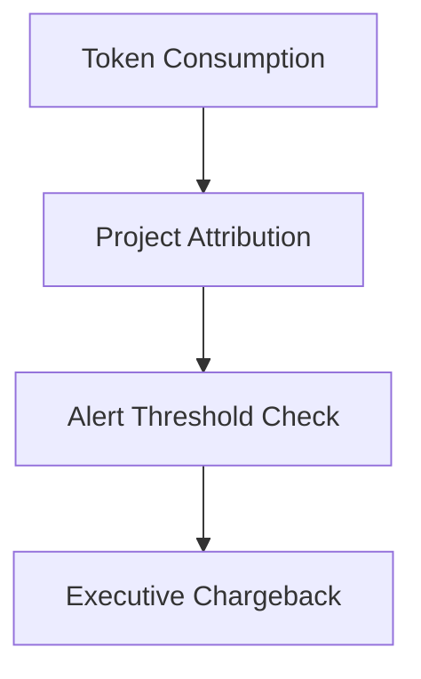
```mermaid
graph TD
    Usage[Token Consumption] --> Alloc[Project Attribution]
    Alloc --> Budget[Alert Threshold Check]
    Budget --> Report[Executive Chargeback]
```

**Executive Governance Workflow:**
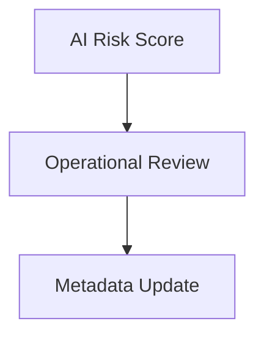
```mermaid
graph TD
    Risk[AI Risk Score] --> Board[Operational Review]
    Board --> Policy[Metadata Update]
```

### 5. Multi-Cloud Intelligence Federation & Global Topology
Automatically managing unified AI standards across global regions (US-East-1, UK-South) and diverse cloud tenants, ensuring institutional data residency and privacy boundaries by default.

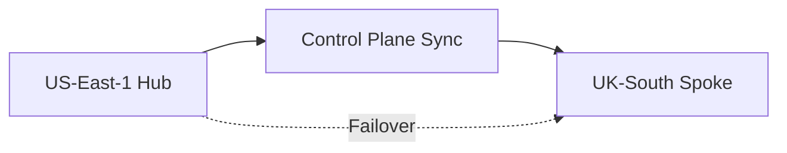
```mermaid
graph LR
    Primary[US-East-1 Hub] --> Sync[Control Plane Sync]
    Sync --> Secondary[UK-South Spoke]
    Primary -.->|Failover| Secondary
```

**Global Region AI Topology:**
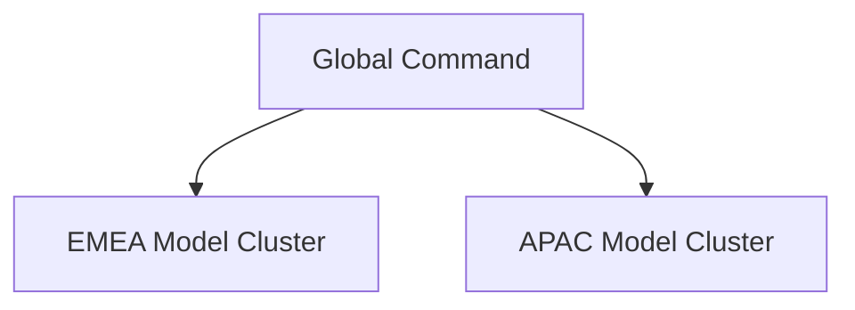
```mermaid
graph TD
    Center[Global Command]
    Center --> R1[EMEA Model Cluster]
    Center --> R2[APAC Model Cluster]
```

### 6. Encryption & Perimeter Protection Flow (Security Trust Boundary)
Managing the lifecycle of an AI request, automatically enforcing institutional TLS 1.3 and Private Link standards (WAF, VPC Interface Endpoints) as required by security policy, ensuring zero-latency security confidence.

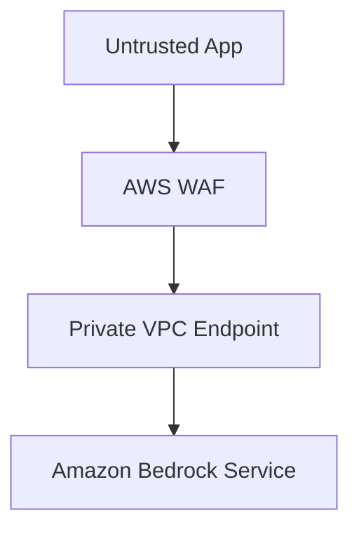
```mermaid
graph TD
    Client[Untrusted App] --> WAF[AWS WAF]
    WAF --> VPCE[Private VPC Endpoint]
    VPCE --> Bedrock[Amazon Bedrock Service]
```

**Private Endpoint Flow:**
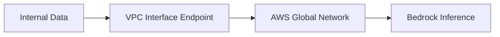
```mermaid
graph LR
    Data[Internal Data] --> End[VPC Interface Endpoint]
    End --> Private[AWS Global Network]
    Private --> Model[Bedrock Inference]
```

**Responsible AI Control Loop:**
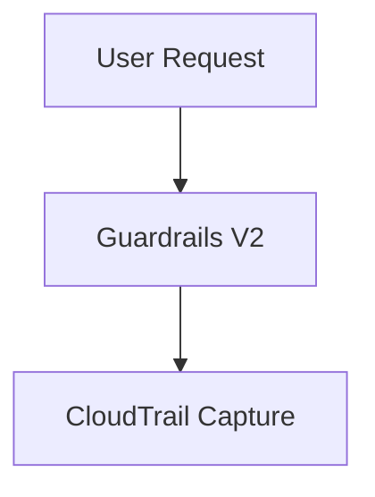
```mermaid
graph TD
    RealTime[User Request] --> Filter[Guardrails V2]
    Filter --> Audit[CloudTrail Capture]
```

### 7. Institutional Intelligence Maturity Scorecard (Throughput & Billing)
Grading organizational performance based on key indicators: Inference Velocity, Token Accuracy, and Billing Attribution.

**Chargeback Workflow:**
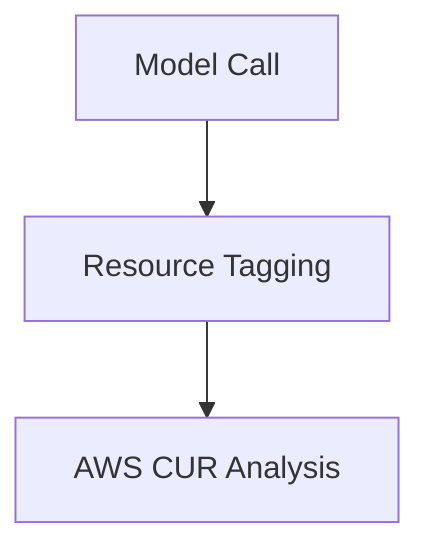
```mermaid
graph TD
    Inference[Model Call] --> Tag[Resource Tagging]
    Tag --> Bill[AWS CUR Analysis]
```

### 8. Identity & RBAC for AI Governance
Managing fine-grained access to AI hubs, provisioning workers, and audit logs between Global Organizations and Business Unit sandboxes.

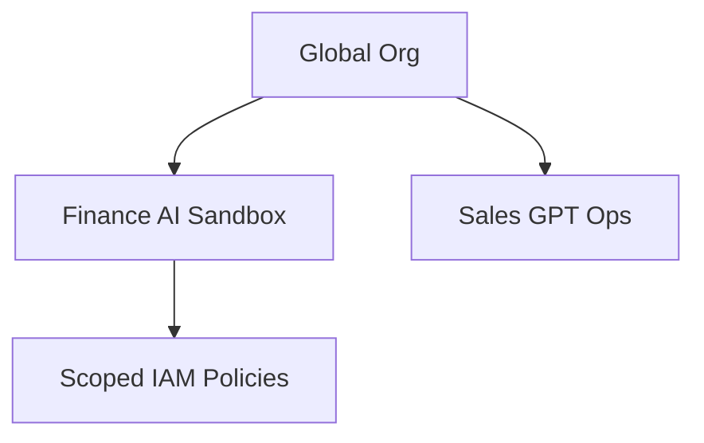
```mermaid
graph TD
    Holding[Global Org]
    Holding --> BU1[Finance AI Sandbox]
    Holding --> BU2[Sales GPT Ops]
    BU1 --> Policy[Scoped IAM Policies]
```

**Identity Federation Model:**
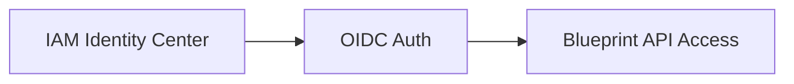
```mermaid
graph LR
    IC[IAM Identity Center] --> SSO[OIDC Auth]
    SSO --> API[Blueprint API Access]
```

### 9. IaC Deployment: AWS-Bedrock-Blueprints-as-Code Framework
Using modular CI/CD pipelines to deploy and manage the versioned distribution of the AI hubs, evaluation engines, and validation fleets.

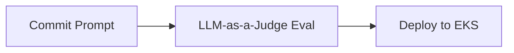
```mermaid
graph LR
    Push[Commit Prompt] --> Test[LLM-as-a-Judge Eval]
    Test --> Release[Deploy to EKS]
```

### 10. AIOps Intelligence Drift & Risk Validation Flow
Using advanced analytics to identify sudden surges in inference failures, unauthorized model changes, or unusual delivery pattern changes that could result in institutional risk or downtime.

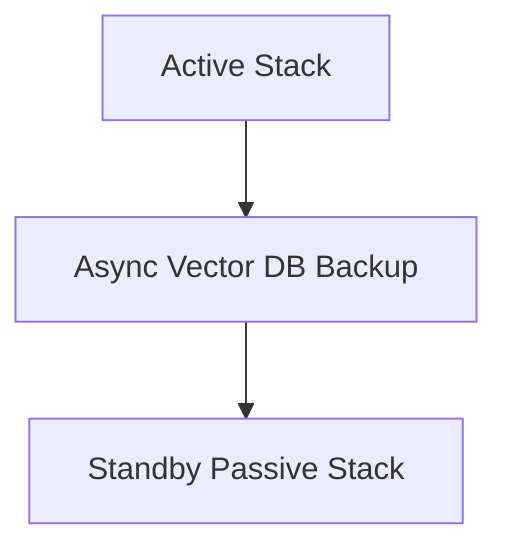
```mermaid
graph TD
    Prod[Active Stack] --> BK[Async Vector DB Backup]
    BK --> DR[Standby Passive Stack]
```

### 11. Metadata Lake for Forensic AI Audit
Storing long-term records of every AI integration event (metadata), every inference call executed, and every monitoring telemetry for institutional record-keeping and forensic analysis.

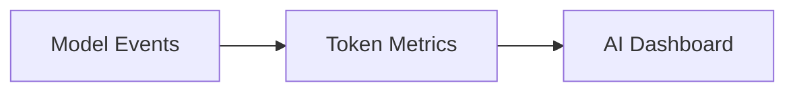
```mermaid
graph LR
    CloudWatch[Model Events] --> Prometheus[Token Metrics]
    Prometheus --> Grafana[AI Dashboard]
```

---

## 🏛️ Core Governance Pillars

1.  **Unified Foundation Coordination**: Maximizing resilience by centralizing all AI intelligence measurement through a single institutional plane.
2.  **Automated RAG Provisioning**: Eliminating "manual tracking" scenarios through proactive orchestration and pattern verification.
3.  **Sequential Intelligence Operations**: Ensuring zero-interruption operations through dependency-aware ingestion-driven data engineering.
4.  **Zero-Trust Identity Protection**: Automatically enforcing identity-based access, private endpoint encryption, and policy evaluation across all assurance tiers.
5.  **Autonomous Operations Logic**: Guaranteeing reliability through automated industry-specific effectiveness monitoring runbooks.
6.  **Full Intelligence Auditability**: Immutable recording of every model change and intelligence provision for institutional forensics.

---

## 🛠️ Technical Stack & Implementation

### Intelligence Engine & APIs
*   **Framework**: Python 3.11+ / FastAPI.
*   **Performance Engine**: Custom Python-based logic for multi-cloud model reconciliation and DORA-style AI metrics.
*   **Integrations**: Native connectors for AWS Bedrock, OpenSearch, S3, and LangChain.
*   **Persistence**: PostgreSQL (Intelligence Ledger) and Redis (Live Inference State).
*   **Auth Orchestrator**: Federated OIDC/SAML for least-privilege intelligence management access.

### Governance Dashboard (UI)
*   **Framework**: React 18 / Vite.
*   **Theme**: Dark, Slate, Indigo (Modern high-fidelity productivity aesthetic).
*   **Visualization**: D3.js for delivery topologies and Recharts for ROI velocity analytics.

### Infrastructure & DevOps
*   **Runtime**: AWS EKS or Azure Kubernetes Service (AKS) for management plane.
*   **Measurement Hub**: Managed event sourcing for immutable productivity timeline reconstruction.
*   **IaC**: Modular Terraform for deploying the intelligence landing zone and validation fleet.

---

## 🏗️ IaC Mapping (Module Structure)

| Module | Purpose | Real Services |
| :--- | :--- | :--- |
| **`infrastructure/intelligence_hub`** | Central management plane | EKS, PostgreSQL, Redis |
| **`infrastructure/enforcers`** | Distributed model provisioners | Azure, AWS, GCP APIs |
| **`infrastructure/rag_pipes`** | Data Ingestion Hubs | Webhooks, Lambda |
| **`infrastructure/auditing`** | Forensic modernization sinks | S3, Athena, Quicksight |

---

## 🚀 Deployment Guide

### Local Principal Environment
```bash
# Clone the AWS Bedrock Blueprints repository
git clone https://github.com/devopstrio/aws-bedrock-blueprints.git
cd aws-bedrock-blueprints

# Configure environment
cp .env.example .env

# Launch the Intelligence stack
make init

# Trigger a mock intelligence update and automated guardrail validation simulation
make simulate-ai
```

Access the Management Portal at `http://localhost:3000`.

---

## 📜 License
Distributed under the MIT License. See `LICENSE` for more information.

---
<div align="center">
  <p>© 2026 Devopstrio. All rights reserved.</p>
</div>
